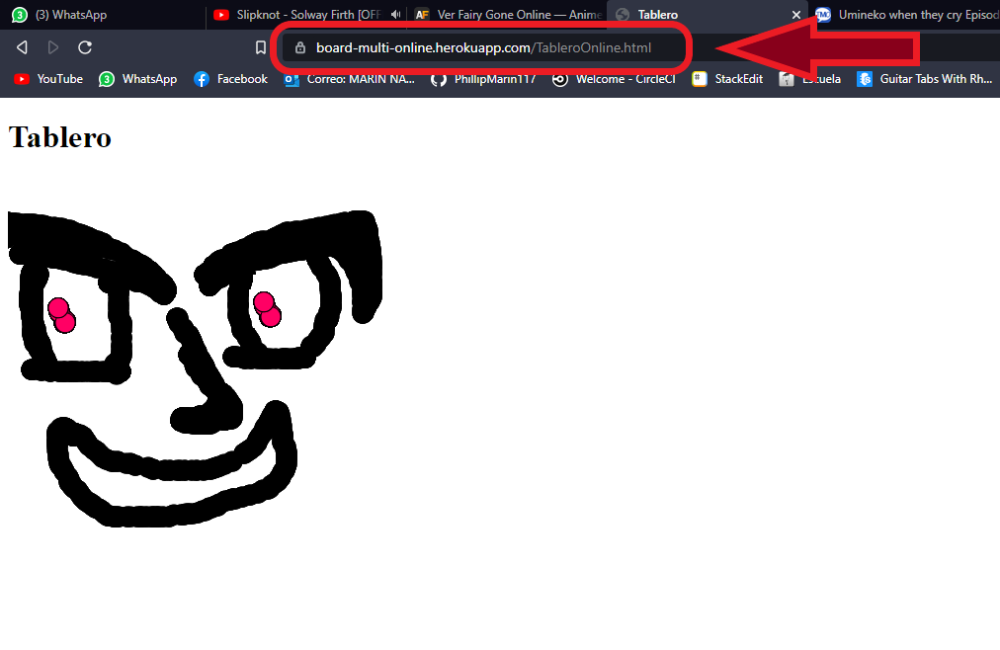
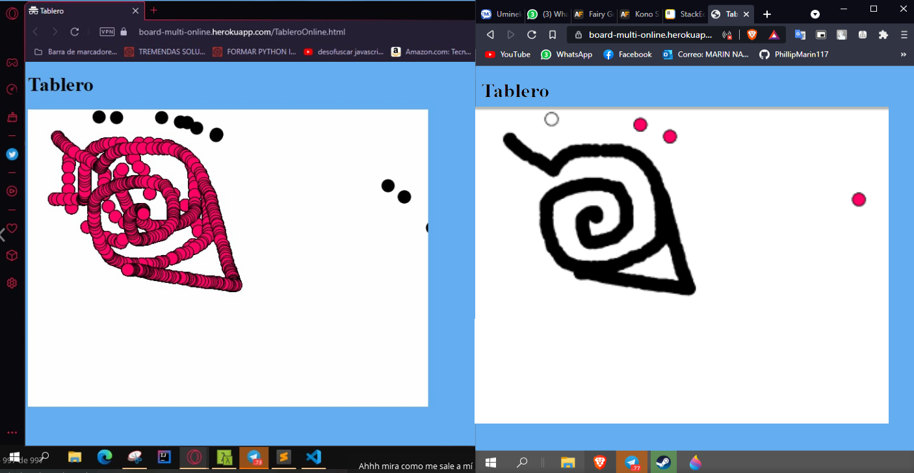

# Lab6 ARSW- Primeros Pasos con Heroku Spring

El siguiente repositorio contiene un programa sencillo de una aplicación web ssobre un tablero multiusuario en el cual varias personas puedan entrar y escribir y que los demas vean lo que escribieron

## Instrucciones de uso

Para poder usar el proyecto lo primero que debe realizar es clonar este repositorio utilizando el siguiente comando desde la terminal del S.O que este utilizando:

```
git clone https://github.com/PhillipMarin117/ARSW-Lab6
```
Otra alternativa es descargarlo directamente por formato ZIP en el botón que indica **"Clone or Download".**
Luego debe redirigirse por medio de la terminal al directorio raíz la cual contiene el archivo pom.xml.

Una vez se encuentre en este directorio se debe compilar el programa para esto se debe ejecutar el siguiente comando:

```
mvn package
```
Luego para su correcta compilación escriba el comando 
```
mvn compile
```

### Prerequisitos

Para ejecutar con éxito este programa se requiere de los siguientes programas instalados en su máquina. Se recomienda tener las versiones actualizadas, pero si no al menos con las versiones básicas funcionales. Para lograr conocer si tiene instalados los programas y de paso la versión, ejecute los siguientes comandos
```
java -vesion
git --vesion
mvn -version
heroku --version
```

Le debería aparecer de la siguiente manera
```
java version: "1.8.0_171"
git version: 2.19.1.windows.1
Apache Maven version: 3.6.3
heroku/7.53.0
```
Una vez compliado el repositorio completo se encuentra en posibilidad de probar los siguientes ejercicios:


###  EJERCICIO  - Tablero Online Multiusuario


Intente desarrollar un tablero interactivo que permita a múltiples usuarios dibujar en un tablero compartido. Vea este ejemplo para inspirarse:

https://ldbn.is.escuelaing.edu.co/ipp5/public_html/04eventos/index.html

El tablero debe permitir a múltiples usuarios dibujar en línea y proveer un botón de borrado. Lo que cada persona dibuje debe aparecer en el tablero de todas las otras personas. Cada persona debe iniciar con un color diferente. Cuándo alguien oprime el botón de borrar el tablero se borra para todas las personas.
```
java -cp target/ARSW-Lab4-1.0-SNAPSHOT.jar edu.escuelaing.arsw.app.WebSideControler
```
#### Despliegue en Heroku
En el siguiente enlace podrá encontrar el servidor desplegado
https://board-multi-online.herokuapp.com/TableroOnline.html


A continuación puede evidenciar que el tablero es multiusuario ya que junto a un compañero lo probamos para notar que lo que uno escribiera el otro también lo vería



## Construido con


* [Maven](https://maven.apache.org/) - Dependency Management
* [Java](https://www.java.com/es/download/) - Lenguaje de programación
* [JavaScript](https://www.javascript.com/) - Lenguaje de programación
*  [HTML](https://html.spec.whatwg.org/multipage/) - Lenguaje de programación
*  [Spring ](https://spring.io/quickstart)  - Framework
* [Heroku ](https://spring.io/quickstart) - Despliegue Web
* [Git](https://github.com/) - Versionamiento


## Authors

* **Felipe Marín** - *LOCS/Hora  400/9 = 3.2 LOCS/Hora* - Fecha: 27/06/2021


## Licencia

This project is licensed under the MIT License - see the [LICENSE.md](LICENSE.md) file for details

## Enlace al sistema de integración continua

_A continuación se presenta el link:_
[](https://circleci.com/gh/PhillipMarin117/ARSW-Lab6)